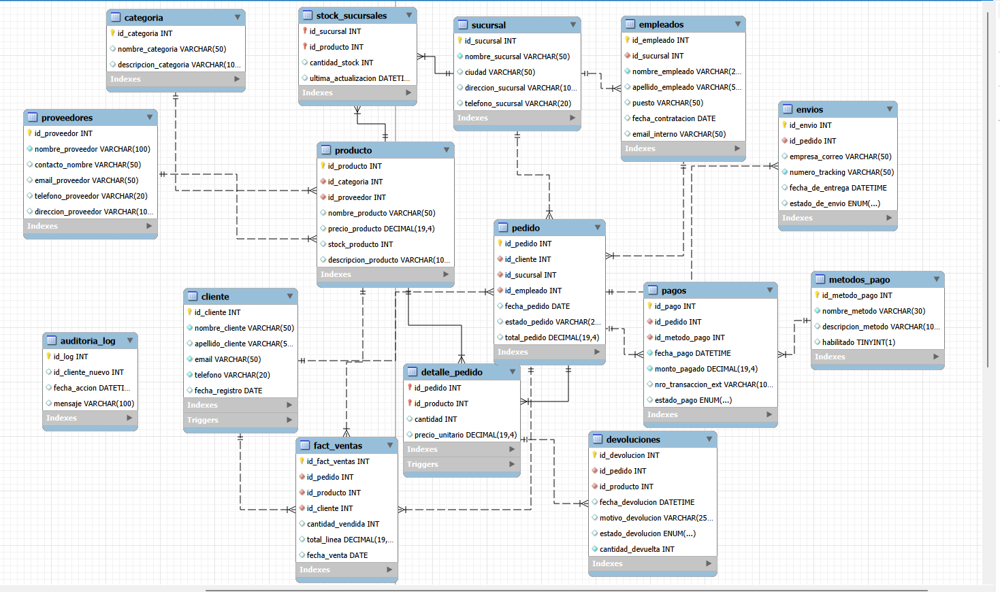

# Proyecto Final — Base de Datos Relacional

### Gestión de E-commerce y Logística de Hardware - VERTEX

## 1) Nombre del proyecto
**VERTEX Platform**: Sistema integral de gestión para el comercio electrónico de hardware, periféricos y componentes de computación con control de stock multi-sucursal.

---

## 2) Introducción
El proyecto consiste en una solución de base de datos orientada a empresas de retail tecnológico que enfrentan dificultades en la trazabilidad de sus operaciones. 

**La plataforma permite:**
* Registrar y gestionar perfiles de clientes de forma única.
* Administrar un catálogo de productos categorizado por tipo y proveedor.
* Controlar el inventario físico distribuido en diferentes sucursales.
* Procesar pedidos vinculando empleados, métodos de pago y estados de envío.
* Automatizar el flujo de datos hacia tablas de hechos para análisis posterior.

---

## 3) Objetivo
Diseñar e implementar una base de datos relacional robusta que resuelva la fragmentación de la información operativa.

**La solución cubre:**
* **Gestión Operativa:** Administración de stock, empleados por sucursal y proveedores.
* **Control Transaccional:** Registro seguro de pedidos, detalles de facturación y pagos.
* **Automatización Técnica:** Uso de Triggers para validación de stock y procedimientos almacenados (SP) para el registro de ventas complejas.
* **Analítica de Datos:** Implementación de una tabla de hechos (`Fact_Ventas`) y vistas de reporte para KPIs de negocio.

---

## 4) Situación problemática
Actualmente, la empresa presenta problemas con el registro de pedidos, ya que la mayoría se almacenan en libros manuales, lo que deriva en pérdida de información y descontento general.

**Problemas que resuelve:**
* **Centralización:** Evita que los pedidos se pierdan al almacenarlos en un sistema digital escalable.
* **Stock inconsistente:** Impide la creación de registros de venta si el inventario es insuficiente mediante barreras de seguridad (Triggers).
* **Falta de trazabilidad:** Permite acceder a la información de manera rápida y eficaz para auditoría.

---

## 5) Modelo de negocio
**Retail Tecnológico**.

**Fuentes de valor:**
* **Optimización de inventario:** Evita pérdidas por ventas que no se pueden cumplir debido a la irresponsabilidad en la toma de pedidos.
* **Eficiencia operativa:** Acceso rápido a la información organizada de clientes y pedidos.

---

## DER (Diagrama Entidad-Relación)
 

---
Para este proyecto, se implementó un tablero de control interactivo que permite transformar los datos transaccionales en decisiones estratégicas. 

**Descripción del Informe:**
Este informe analiza de manera integral las ventas mensuales (**KPI 1**), el inventario valorizado distribuido por sucursal (**KPI 2**), el rendimiento operativo de los vendedores (**KPI 3**) y la logística de devoluciones por producto (**KPI 4**) de VERTEX Store.

* **Herramienta:** Microsoft Power BI.
* **Origen de datos:** Conexión directa a la base de datos `schema_final` (MySQL).
* **Propósito:** Proveer visibilidad en tiempo real sobre la rentabilidad y el estado del stock para eliminar la dependencia de registros manuales.

## Enlaces del Proyecto
* **Presentación del Proyecto:** https://gamma.app/docs/VERTEX-Platform-em6au7068owfe1z
